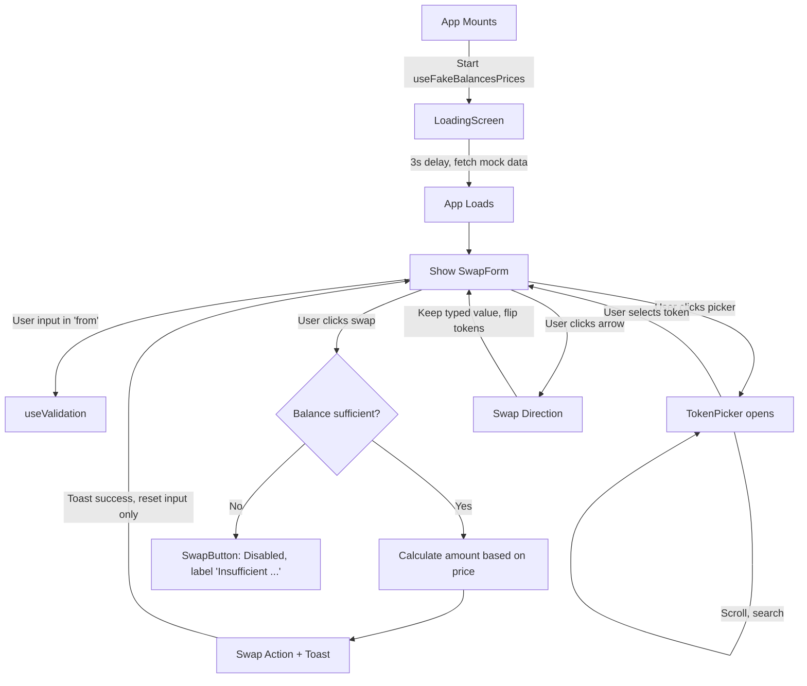

# Currency Swap App – Implementation Plan

## 1. File Structure Proposal

```
problem2/
  src/
    components/
      SwapForm.tsx             # Main form UI and logic
      TokenPicker.tsx          # Popup modal for token selection (with search, infinite scroll)
      TokenRow.tsx             # Token display row (icon, symbol, balance)
      SwapButton.tsx           # Swap/submit button (disabled if invalid)
      LoadingScreen.tsx        # Full-screen loading spinner
      Toast.tsx                # Notification pop-up
    hooks/
      useFakeBalancesPrices.ts # Simulate loading & fetch for balances/prices with sorting & paging
      useSwapAction.ts         # Handle swapping, state transitions, input formatting, success toast
      useValidation.ts         # Input validation (number, decimal, balance check, ...)
    ultis/
      tokenIconUrl.ts          # Helper to get icon URL, fallback logic
      formatters.ts            # Format balance, number, truncate, etc.
    data/
      balances.json            # For development/testing the random balances
    App.tsx                    # App outer shell (includes SwapForm, LoadingScreen, Toast root)
```


## 2. Main Components & Their Roles

- **SwapForm**: Manages form state, input, current tokens, open modal state, swap action
- **TokenPicker**: List tokens for selection; supports search, pagination (infinite scroll)
- **TokenRow**: Renders selectable row with icon, symbol, balance; used in picker or summary
- **SwapButton**: Handles submit, disable, dynamic label (swap, insufficient balance...) 
- **LoadingScreen**: Covers whole app during 3s fake data load
- **Toast**: Triggers on swap success

## 3. Main Hooks & Logic

- **useFakeBalancesPrices**: 
  - On mount, fake load balances & prices with a 3s delay
  - Returns balances (≥20 tokens, random data, sorted), prices, loading state
  - Supports pagination and search for picker

- **useSwapAction**:
  - Handles input value, changes, swap direction, validation, resets
  - Computes quote automatically based on formula
  - Triggers swap, sets toast, clears input

- **useValidation**:
  - Checks input for: number, decimal, within current balance
  - Returns error states to disable button and show messages

## 4. App Flow (Detailed, with direction arrows)



## 5. Notes
- Only editable input is the token on top ('from'), only one direction allowed at a time
- Picker disables tokens with zero balance for 'from' selection
- Context can be used if children need prices/balances
- All UI/labels/messages are in English
- Notification is shown via Toast component

---

When implementing, start with useFakeBalancesPrices, then LoadingScreen, then gradually compose SwapForm & remaining UI components, following flow above.
